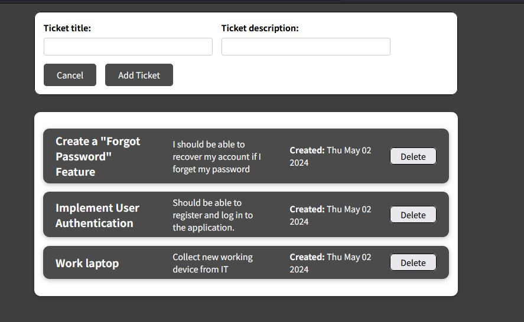

# Ticket System Application

This is a simple ticket system application built with a Node.js, Express, and TypeScript backend, and a React JavaScript frontend.

## Features

- Create a new ticket
- View existing tickets
- Delete a ticket

## Tech Stack

- Backend: Node.js, Express, TypeScript
- Frontend: React, JavaScript
- Package Manager: npm

## Setup and Installation

Follow these steps to set up and run this project locally.

### Prerequisites

- Node.js installed (version 14.x or later recommended)
- npm installed (version 6.x or later recommended)

### Steps

1. Navigate to the project directory.

```bash
cd web-app/frontend
```

2. Install the required dependencies.

```bash
npm install
```

3. Create a `.env` file in the root directory of the project and add your environment variables. Refer to the `.env` file provided in the code excerpts for the required environment variables.

4. Start the backend server.

```bash
npm run dev
```

5. In a new terminal, navigate to the frontend directory.

```bash
cd web-app/frontend
```

6. Install the required frontend dependencies.

```bash
npm install
```

7. Start the React application.

```bash
npm start
```

The application should now be running on `localhost:3000` (or your specified PORT).

## Usage

- To create a new ticket, fill in the ticket title and description, then click "Add Ticket".
- To view existing tickets, navigate to the "Tickets" page.
- To delete a ticket, click the "Delete" button next to the ticket you want to delete.

## UI
